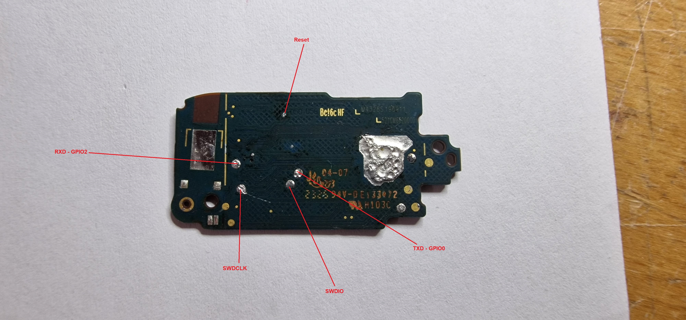

# ATC MiBand8 Fw

This is the most minimal demo of a custom firmware for the Xiaomi Mi Band 8

### Everything is really just bare minimum and not nice to read, but better i publish this now than never!

Here is a YouTube video that shows the general function
https://youtu.be/L2ugXV0ao3Q

To build each example you need to enter the "gcc" folder of the choosen one and enter make, with an Segger flasher connected you can also use "flash.bat" and it will directly flash the firmware to the device. (Change the directy to the correct one in the file "jlink_auto_file.jlink" beforehand)

In the folder "Custom_Firmware\boards\apollo4l_blue_evb\examples\peripherals\hello_world_lcd" you can find a Rickroll Gif example.

In the folder "Custom_Firmware\boards\apollo4l_blue_evb\examples\peripherals\hello_world_uart" you can find an example of using the display, touchscreen and Light sensor, the Accl is started but not working right now( No idea when that will be finished :D )

If you download the stock SDK from Ambiq.com you can also build working BLE examples.

https://ambiq.com/apollo4-blue-lite/

https://contentportal.ambiq.com/apollo4-blue-lite

Find the reversed pinout in the file "Pinout_MiBand8.ods" (OpenOffice)

To flash a the Apollo 4 Blue Light SoC connect the SWD flasher to the pins: SWDIO and SWCLK, it is also best to connect to the Reset pin (small testpad) as the stock firmware disables the SWD interface after boot.

The TXD Pin will output debug UART messages on 115200 baud

See the pinout images for the further pins on the PCB

